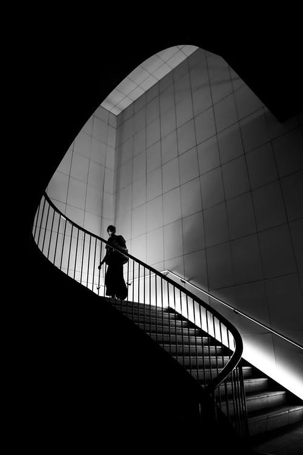
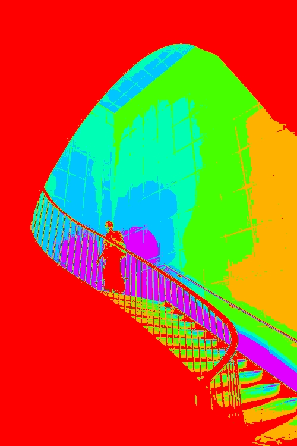

# ImageColoriser
 Greyscale images to Color images using python and DL

 Hosted at [https://infinityjoker-imagecoloriser.herokuapp.com/](https://infinityjoker-imagecoloriser.herokuapp.com/)

# GUI
 - Install streamlit using
   ```
   pip install streamlit
   ```
 - Launch Streamlit GUI in the repo folder by
   ```
   streamlit run app.py
   ```

# Sample Image



# Non-AI Methods
 - Clustering based Colorisation
    - Colorise images using inversed mapping of greyscale value to rgb

    

 - Thresholding based Colorisation
    - Colorise images based on the greyscale value
    - Assign particular color if value lies within threshold

    

# AI Methods
 - In Dev, stay tuned :-)